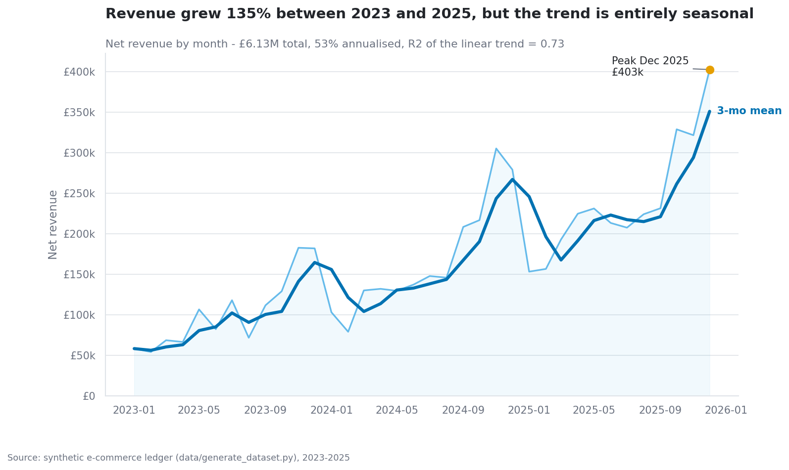
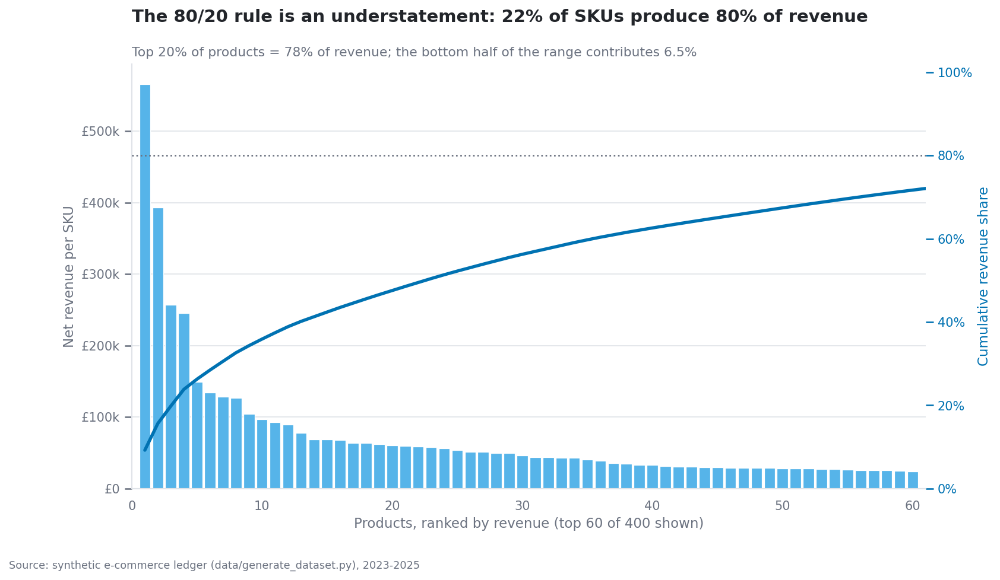
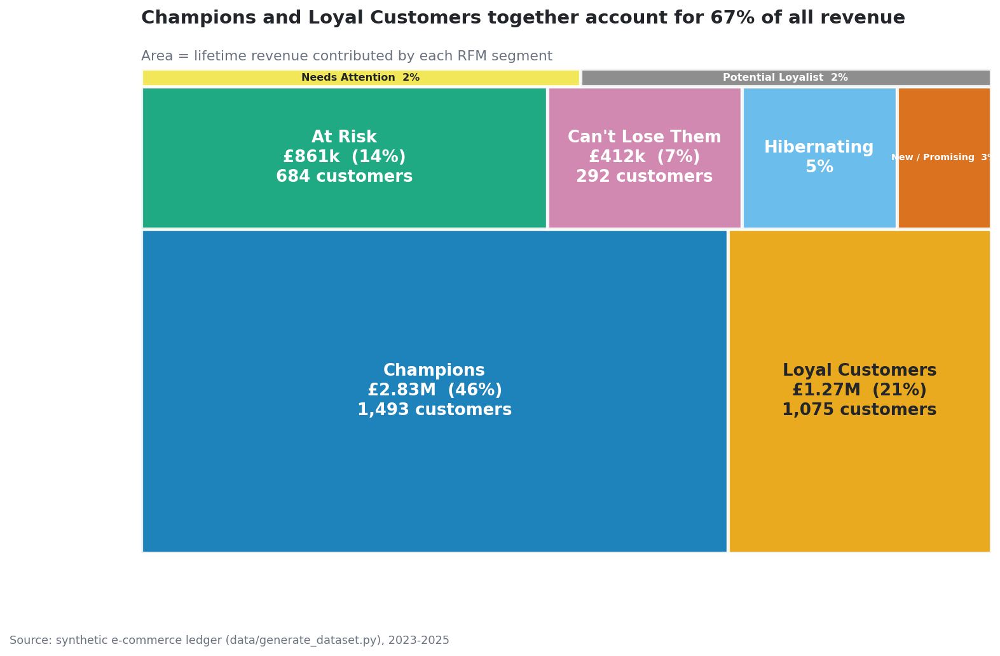

# E-commerce Sales & Customer Behaviour Analysis

An end-to-end analytics project: a deliberately messy raw dataset, a documented cleaning
layer, a feature layer, a statistical analysis, fourteen publication-quality figures, an
executed EDA notebook and a written set of findings with quantified recommendations.

Everything is self-contained and offline. `python data/generate_dataset.py && python run_analysis.py`
reproduces every number, chart and report in this repository from scratch.

---

## What it answers

| # | Question | Where |
|---|---|---|
| Q1 | How is revenue trending, and what is month-on-month growth? | [findings §1](reports/findings.md) |
| Q2 | Is there seasonality, and does day-of-week matter? | findings §2 |
| Q3 | Which products drive revenue - does the 80/20 rule hold? | findings §3 |
| Q4 | Which categories actually make money (margin, not turnover)? | findings §4 |
| Q5 | How do regions compare on revenue, AOV and value per customer? | findings §5 |
| Q6 | What is the channel mix, and is it shifting? | findings §6 |
| Q7 | How well do acquisition cohorts retain? | findings §7 |
| Q8 | What do the RFM segments look like and what are they worth? | findings §8 |
| Q9 | What is a customer worth (CLV), and who is about to churn? | findings §9 |
| Q10 | Does average order value differ by customer segment? | findings §10 |
| S1 | Is Web AOV really different from Mobile App AOV? (Welch t-test) | findings §11 |
| S2 | Are customer segment and region independent? (chi-square) | findings §11 |
| S3 | Does gross margin differ across categories? (one-way ANOVA) | findings §11 |

Each statistical test states its assumptions, checks them, reports an effect size next to the
p-value, and re-runs the question with a distribution-free equivalent so the conclusion never
rests on a normality assumption that order values obviously violate.

---

## The dataset

> **The data is synthetic.** It is generated by [`data/generate_dataset.py`](data/generate_dataset.py)
> with a fixed seed (42) and contains no real people, companies or transactions. Both the
> generator and its output CSVs are committed so the project is reproducible byte-for-byte and
> needs no network access.

| File | Rows | Contents |
|---|---|---|
| `data/raw/orders.csv` | 49,645 order **lines** (26,818 orders) | `order_id, customer_id, order_date, product_id, quantity, unit_price, discount, shipping_cost, payment_method, channel, region` |
| `data/raw/customers.csv` | 8,000 | `customer_id, signup_date, age, gender, city, region, segment` |
| `data/raw/products.csv` | 400 | `product_id, name, category, subcategory, cost, list_price, supplier` |

The generator models behaviour rather than sprinkling noise: a growth trend, a Black-Friday /
Christmas peak with a January trough, weekday-vs-weekend patterns, per-customer retention decay
(which is what produces realistic cohort curves), Pareto-shaped demand, category-dependent
margins and channel-dependent basket depth.

It then breaks the data on purpose, so the cleaning layer has real work to do:

* **~300 exact duplicate rows** (a double-ingest bug)
* **~2% missing values** across `discount`, `shipping_cost`, `payment_method`, `region`,
  `quantity`, `age`, `gender`, `city`, `supplier`, `subcategory`
* **~0.8% negative quantities** - returns booked against the original order
* **two date formats in the same column** - `2024-03-04` and `04/03/2024`
* **inconsistent city capitalisation** - `manchester`, `MANCHESTER`, `  Manchester `
* **numbers stored as text** - `"$1,299.00"`, `"15.0%"`
* **extreme unit prices** - fat-finger entries and bundle SKUs
* a handful of impossible ages (0, 130, 999) and SHOUTING category labels

---

## Pipeline

```
data/generate_dataset.py                 fixed seed 42, no network
        │
        ▼
  data/raw/*.csv                         messy on purpose
        │
        ▼
┌──────────────────────┐   dedupe · type coercion · dual-format date parsing
│  src/cleaning.py     │   per-column missing-value policy · IQR outlier FLAGS
└──────────┬───────────┘   category & city normalisation · referential checks
           │  ├──► data/processed/clean_orders.parquet (+ .csv)
           │  └──► reports/data_quality_report.md
           ▼
┌──────────────────────┐   revenue · margin · discount rate · order size
│  src/features.py     │   RFM · cohort month · tenure · CLV · churn risk
└──────────┬───────────┘   basket categories
           │  └──► data/processed/order_features.parquet, customer_features.parquet
           ▼
┌──────────────────────┐   trend · seasonality · Pareto · category economics
│  src/analysis.py     │   regions · channels · cohorts · RFM · CLV · churn
└──────────┬───────────┘   3 statistical tests with assumption checks
           │
           ├──────────────► src/visualize.py ──► reports/figures/*.png  (14 charts)
           │                (shared style: src/plot_style.py)
           ▼
   src/run_analysis.py ─────────────────────► reports/findings.md
```

Run the whole thing:

```bash
pip install -r requirements.txt --break-system-packages
python data/generate_dataset.py     # writes data/raw/*.csv   (~5 s)
python run_analysis.py              # clean → features → analysis → figures → report (~20 s)
```

Individual stages, tests and the notebook:

```bash
python src/cleaning.py              # just the cleaning + data quality report
python src/analysis.py              # just the analysis, printed to stdout
python src/visualize.py             # just the figures
python -m pytest tests/ -v          # 38 tests
jupyter nbconvert --to notebook --execute --inplace notebooks/eda.ipynb
```

---

## Key findings (from the committed run)

**Scope:** 49,130 clean order lines · 26,758 orders · 6,703 purchasing customers · 400 SKUs ·
Jan 2023 – Dec 2025 · **£6.13M** net revenue · **£1.95M** gross profit (31.8% margin).

**1. Growth is real but seasonal.** Revenue rose from £1.23M (2023) to £2.89M (2025), +135%
(≈53% a year) — yet 27% of a typical year lands in November–December and January is 38% below
an average month.



**2. The range is far more concentrated than 80/20.** 89 of 400 SKUs (22%) generate 80% of
revenue; the top 20% of the range generates 78%, while the bottom 200 SKUs contribute 6.5%.



**3. The biggest category is the least profitable.** Electronics is 42% of revenue but only 30%
of gross profit at a 22.6% margin, against Beauty at 53.7% — a 31 percentage-point spread that
a one-way ANOVA confirms is real (F = 7,641, p < 0.0001, η² = 0.52).

**4. A fifth of customers carry half the business.** The 1,493 RFM "Champions" are 22% of
purchasing customers but 46% of revenue; the top revenue decile alone is 41%. Mean CLV £1,030
vs median £474 — the average customer does not exist.



**5. Retention decays fast and 37% of the base is drifting.** Only 21% of a cohort orders again
in month 1 and 13% are still active at month 12. 2,453 customers are past their own reorder
window, carrying £1.68M of historic revenue (27% of the total).

**Recommendations** (sized in [`reports/findings.md`](reports/findings.md)): cut the SKU tail,
rebalance the category mix towards margin (~£32k of gross profit a year for a 5-point mix shift),
and win back the 738 lapsing high-value customers (~£127k at a 10% recovery rate).

---

## Repository structure

```
08-data-analysis/
├── README.md
├── requirements.txt
├── run_analysis.py                 entry point (shim → src/run_analysis.py)
├── data/
│   ├── generate_dataset.py         synthetic data generator, seed 42
│   ├── raw/                        orders.csv, customers.csv, products.csv  (committed)
│   └── processed/                  clean_orders.parquet/.csv, *_features.parquet
├── src/
│   ├── config.py                   paths + project constants
│   ├── cleaning.py                 cleaning, quality log, data-quality report
│   ├── features.py                 money, calendar, RFM, cohort, CLV, churn
│   ├── analysis.py                 the ten business questions + three tests
│   ├── plot_style.py               shared colourblind-safe chart style + treemap
│   ├── visualize.py                the fourteen figures
│   └── run_analysis.py             orchestration + findings.md writer
├── notebooks/
│   └── eda.ipynb                   executed narrative EDA (outputs saved)
├── tests/
│   └── test_pipeline.py            38 pytest cases
└── reports/
    ├── data_quality_report.md      before/after counts, per-column issue table
    ├── findings.md                 the write-up, every number from the live run
    └── figures/                    01..14 *.png
```

## Charts

All fourteen figures share one style module (`src/plot_style.py`): the Okabe-Ito
colourblind-safe palette, a perceptually-uniform sequential map for heatmaps, no chartjunk,
direct labelling instead of legends wherever it fits, and **titles that state the finding**
rather than naming the field. Every headline number in a chart title is interpolated from the
data, so regenerating the dataset regenerates the headline.

`01` revenue trend + rolling mean · `02` MoM growth · `03` seasonality heatmap ·
`04` day-of-week · `05` Pareto · `06` category margin box plots · `07` revenue-vs-margin bubble ·
`08` regional bars · `09` channel mix over time · `10` cohort retention heatmap ·
`11` RFM scatter · `12` RFM treemap · `13` correlation matrix · `14` distribution panel

## Tech stack

Python 3.11 · pandas · numpy · scipy · matplotlib · seaborn · pyarrow (parquet) ·
jupyter / nbconvert · pytest. No network access, no external data, no paid services.

## Tests

`python -m pytest tests/ -v` — 38 cases covering:

* cleaning primitives (currency/percent coercion, dual-format date parsing, text normalisation, IQR flags)
* **idempotency** — `clean(clean(x)) == clean(x)` on both a fixture and the real dataset
* **post-clean invariants** — no nulls, no duplicates, dates parsed, discounts in `[0, 1]`, quantity integral
* **outliers flagged, never dropped** — every lost row is reconciled against the quality log
* **feature correctness** on a hand-computed fixture (revenue, margin, contribution, basket
  aggregation, cohort index, order sequence, CLV formula, RFM labels)
* integration checks that the three grains reconcile and the statistical tests return valid p-values
