# E-commerce Sales & Customer Behaviour - Findings

*Generated by `src/run_analysis.py` on 2026-08-20 17:27. All figures come from the run described in [data_quality_report.md](data_quality_report.md).*

**Scope:** 49,130 order lines, 26,758 orders, 6,703 purchasing customers, 400 SKUs, Jan 2023 - Dec 2025. Net revenue £6,133,292, gross profit £1,950,412 (31.8% margin).

## Executive summary

### Five things the data says

1. **Revenue is growing fast but the growth is seasonal, not structural.** Net revenue rose from £1,230,751 in 2023 to £2,888,502 in 2025 (+135%, 53% a year). But 27% of a typical year's revenue lands in November and December, and January is the single worst month at -38% versus an average month. Peak trading month: December 2025 at £402,715.

2. **The range is far more concentrated than 80/20 - it is closer to 22/80.** 89 of 400 SKUs generate 80% of revenue; the top 20% of the range generates 78%. The bottom half of the catalogue - 200 SKUs - contributes 6.5% of revenue while consuming the same buying, warehousing and merchandising overhead.

3. **The biggest category is the least profitable one.** Electronics is 42% of revenue but only 30% of gross profit, at a 22.6% margin. Beauty runs 53.7% - a 31 percentage-point spread that a one-way ANOVA confirms is real (F = 7,641, p < 0.0001, eta-squared = 0.52).

4. **A fifth of customers carry half the business.** The 1,493 RFM 'Champions' are 22% of purchasing customers but 46% of revenue, and the top revenue decile alone accounts for 41%. Mean estimated CLV is £1,030 against a median of £474 - the average customer does not exist.

5. **Retention decays quickly and 37% of the base is already drifting away.** Only 21% of a cohort orders again in month 1 and 13% are still active at month 12. 2,453 customers are past their own normal reorder window, representing £1,682,686 of historic revenue (27% of the total) and £1,361,329 of estimated forward value.

### Three recommendations

**R1. Cut the tail, protect the head.** Delist or consolidate the 311 SKUs outside the 80%-of-revenue core and re-invest the freed working capital and shelf space in the 89 products that already work. Revenue at risk is bounded: the bottom half of the range is only 6.5% of turnover, so even losing all of it costs less than £133,444 a year, against a far larger saving in complexity. Start with SKUs that are both bottom-quartile revenue *and* below-median margin.

**R2. Rebalance the mix towards margin, not turnover.** Electronics buys volume at 22.6% while Beauty and Apparel sit above 48.5%. Shifting just 5 percentage points of revenue mix out of Electronics into Beauty is worth about £95,511 of extra gross profit over a comparable three-year period (£31,837 a year) at identical turnover. Practical levers: category-weighted homepage and email real estate, attach-rate bundles, and pulling discount funding out of Electronics, which already discounts at 7.4%.

**R3. Run a win-back programme against the 738 lapsing high-value customers before they are gone.** They are both in the top two monetary quintiles and past their reorder window, carrying £1,266,315 of historic revenue. A win-back that recovers even 10% of them is worth roughly £126,632, and the same customers are already identified in `data/processed/customer_features.parquet` via `is_churn_risk` and `M`. Pair it with a mobile attach-rate push: Mobile App orders average £173 against £267 on Web (p < 0.0001); closing a quarter of that gap on today's mobile volume is about £65,140 a year.

---

## 1. Revenue trend and growth

| Year | Net revenue | YoY growth |
| --- | --- | --- |
| 2023 | £1,230,751 | - |
| 2024 | £2,014,038 | 63.6% |
| 2025 | £2,888,502 | 43.4% |

The linear trend adds £6,833 of revenue per month (R2 = 0.73, p < 0.0001), but the residual is dominated by seasonality: mean month-on-month growth is 9.3% with a median of 3.3%, and the worst month (February 2023, £54,082) is 87% below the best.

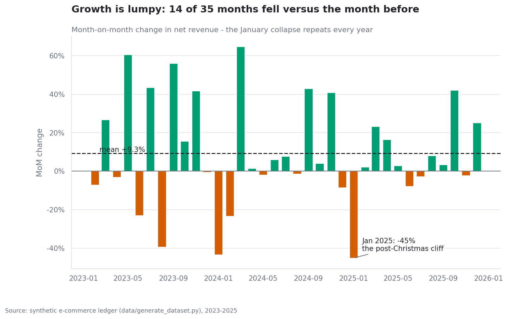

## 2. Seasonality and day-of-week

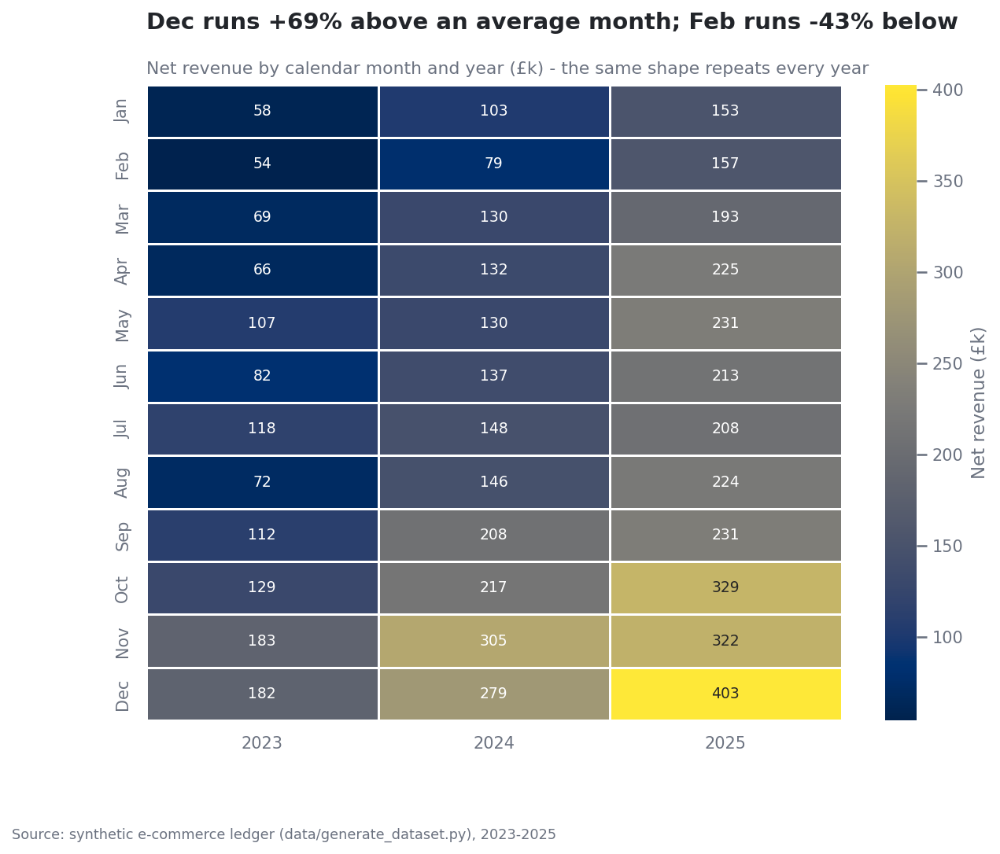

| Month | Avg revenue / year | Index vs avg month |
| --- | --- | --- |
| Jan | £104,830 | 0.62x |
| Feb | £96,553 | 0.57x |
| Mar | £130,513 | 0.77x |
| Apr | £141,039 | 0.83x |
| May | £155,770 | 0.91x |
| Jun | £144,252 | 0.85x |
| Jul | £157,747 | 0.93x |
| Aug | £147,186 | 0.86x |
| Sep | £183,853 | 1.08x |
| Oct | £224,907 | 1.32x |
| Nov | £269,863 | 1.58x |
| Dec | £287,917 | 1.69x |

Weekends take 32% of revenue from 33% of orders - the weekend lift is footfall, not basket size (weekend AOV £224 vs weekday £232).

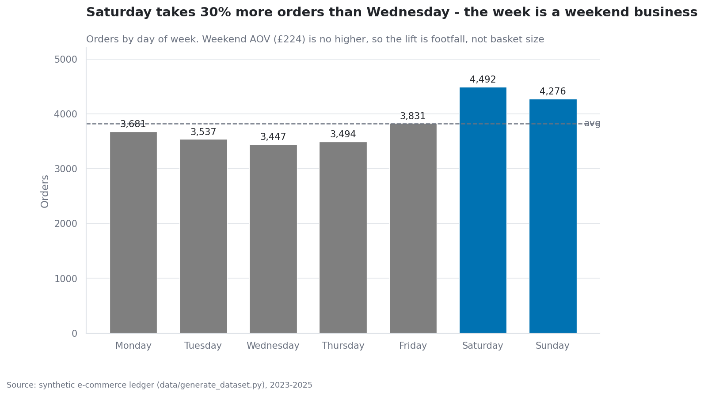

## 3. Products and the Pareto rule

| SKU | Product | Category | Net revenue | Margin | Units | Cumulative share |
| --- | --- | --- | --- | --- | --- | --- |
| P0218 | Pro Phone Pack | Electronics | £565,885 | 23.0% | 1,194 | 9.2% |
| P0290 | Signature Phone Kit | Electronics | £393,546 | 32.7% | 606 | 15.6% |
| P0079 | Everyday Fitnes Collection | Sports & Outdoors | £256,681 | 34.0% | 1,280 | 19.8% |
| P0140 | Everyday Audio Collection | Electronics | £245,680 | 28.0% | 666 | 23.8% |
| P0148 | Signature Cycling Model | Sports & Outdoors | £149,238 | 37.9% | 700 | 26.3% |
| P0069 | Urban Phone Series | Electronics | £134,219 | 13.6% | 168 | 28.5% |
| P0352 | Signature Bedding Pack | Home & Kitchen | £128,704 | 33.7% | 2,208 | 30.6% |
| P0173 | Deluxe Small Appliance Kit | Home & Kitchen | £126,974 | 44.2% | 1,853 | 32.6% |
| P0150 | Classic Camera Line | Electronics | £104,124 | 16.9% | 193 | 34.3% |
| P0037 | Signature Camera Pack | Electronics | £96,700 | 59.4% | 134 | 35.9% |

Top 10 SKUs alone are 35.9% of revenue.

## 4. Category economics

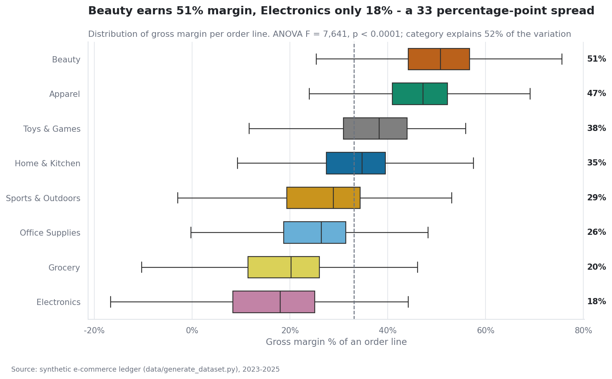

| Category | Net revenue | Rev share | Gross profit | Profit share | Margin | Avg discount |
| --- | --- | --- | --- | --- | --- | --- |
| Electronics | £2,597,284 | 42.3% | £586,041 | 30.0% | 22.6% | 7.4% |
| Home & Kitchen | £1,016,451 | 16.6% | £392,672 | 20.1% | 38.6% | 7.4% |
| Sports & Outdoors | £883,361 | 14.4% | £277,924 | 14.2% | 31.5% | 7.6% |
| Apparel | £745,205 | 12.2% | £361,570 | 18.5% | 48.5% | 7.4% |
| Beauty | £323,922 | 5.3% | £173,975 | 8.9% | 53.7% | 7.4% |
| Office Supplies | £296,600 | 4.8% | £83,559 | 4.3% | 28.2% | 7.4% |
| Grocery | £187,497 | 3.1% | £42,753 | 2.2% | 22.8% | 7.3% |
| Toys & Games | £82,971 | 1.4% | £31,917 | 1.6% | 38.5% | 7.6% |

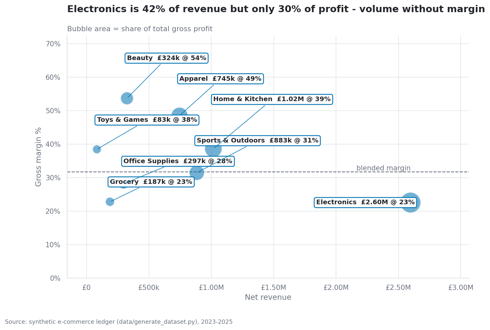

## 5. Regional performance

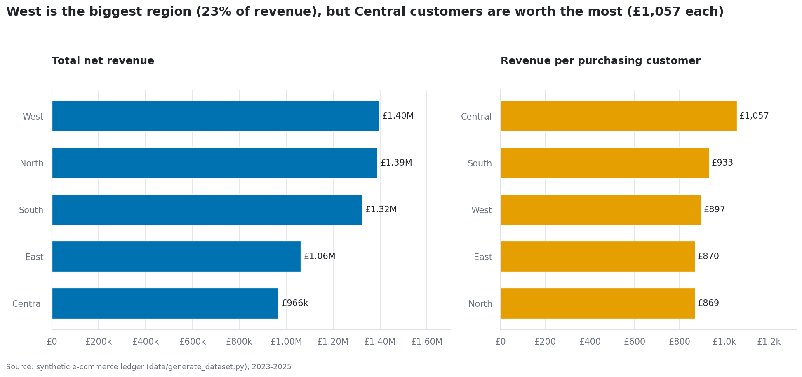

| Region | Net revenue | Share | Orders | AOV | Customers | Revenue / customer | Margin | Shipping % of rev |
| --- | --- | --- | --- | --- | --- | --- | --- | --- |
| West | £1,395,048 | 22.7% | 6,025 | £232 | 1,555 | £897 | 33.1% | 3.5% |
| North | £1,388,221 | 22.6% | 6,326 | £219 | 1,597 | £869 | 29.5% | 3.3% |
| South | £1,323,548 | 21.6% | 5,706 | £232 | 1,418 | £933 | 29.7% | 2.9% |
| East | £1,060,820 | 17.3% | 4,827 | £220 | 1,219 | £870 | 32.4% | 3.4% |
| Central | £965,655 | 15.7% | 3,874 | £249 | 914 | £1,057 | 35.5% | 2.5% |

## 6. Channel mix

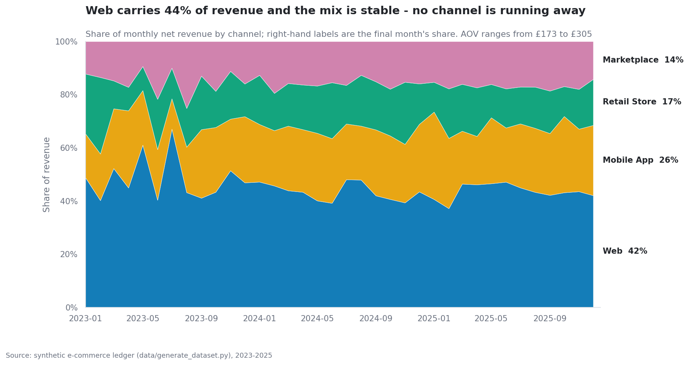

| Channel | Orders | Rev share | AOV | Median AOV | Units / order | Margin | Avg discount |
| --- | --- | --- | --- | --- | --- | --- | --- |
| Web | 10,230 | 44.5% | £267 | £133 | 3.49 | 33.6% | 6.7% |
| Mobile App | 8,302 | 23.4% | £173 | £78 | 2.28 | 31.5% | 7.8% |
| Retail Store | 3,238 | 16.1% | £305 | £165 | 4.01 | 31.0% | 5.9% |
| Marketplace | 4,988 | 16.1% | £197 | £99 | 2.82 | 28.0% | 9.9% |

## 7. Cohort retention

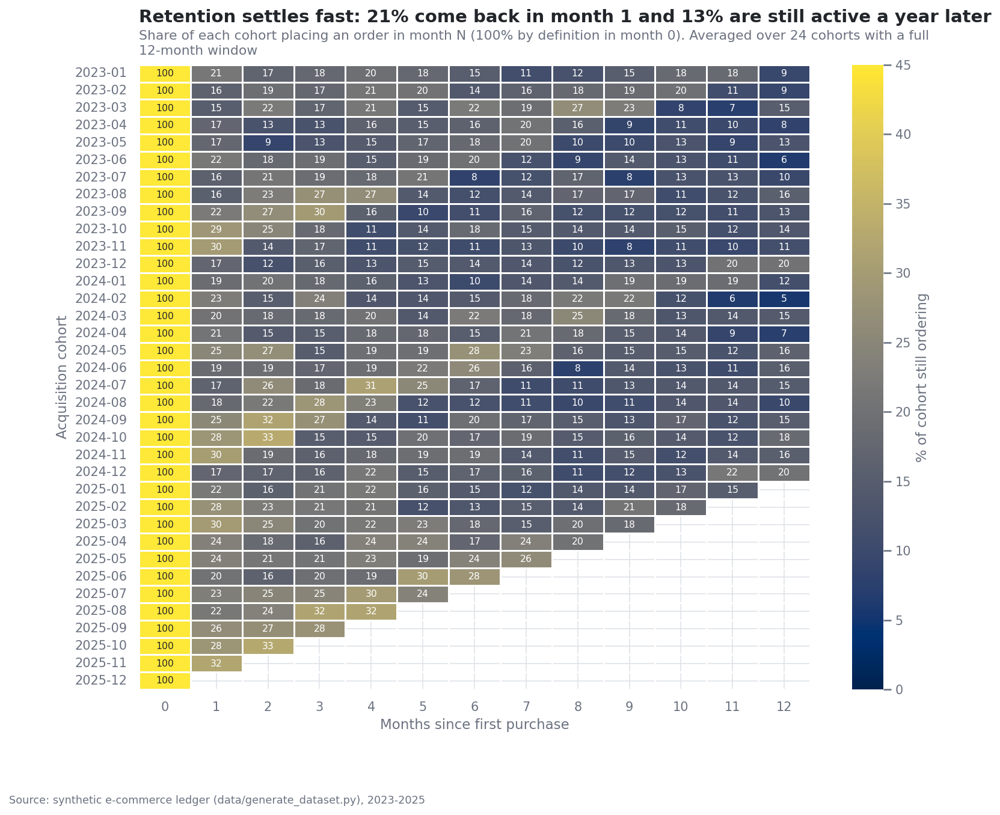

| Month since first order | Active |
| --- | --- |
| 0.00 | 100.0% |
| 1.00 | 20.9% |
| 2.00 | 20.1% |
| 3.00 | 18.8% |
| 4.00 | 18.1% |
| 5.00 | 16.3% |
| 6.00 | 16.5% |
| 7.00 | 15.9% |
| 8.00 | 14.6% |
| 9.00 | 14.4% |
| 10.00 | 13.6% |
| 11.00 | 12.7% |
| 12.00 | 12.9% |

Averaged over the 24 cohorts old enough to have a full 12-month window. The curve flattens after month 3 - the customers who survive the first quarter largely stay, so acquisition quality in month 0-3 is what determines lifetime value.

## 8. RFM segmentation

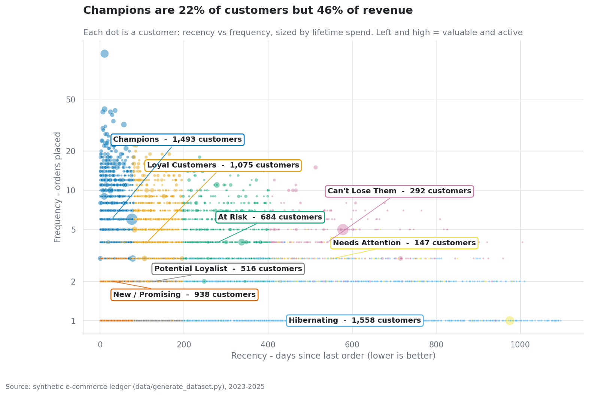

| Segment | Customers | % of base | Revenue | % of revenue | AOV | Orders | Recency (d) | Avg CLV | Churn risk |
| --- | --- | --- | --- | --- | --- | --- | --- | --- | --- |
| Champions | 1,493 | 22.3% | £2,833,837 | 46.2% | £270 | 7.6 | 31 | £2,274 | 0.0% |
| Loyal Customers | 1,075 | 16.0% | £1,268,486 | 20.7% | £270 | 5.1 | 109 | £1,286 | 18.3% |
| At Risk | 684 | 10.2% | £861,072 | 14.0% | £292 | 4.9 | 290 | £869 | 63.0% |
| Can't Lose Them | 292 | 4.4% | £412,176 | 6.7% | £354 | 4.4 | 571 | £808 | 96.2% |
| Hibernating | 1,558 | 23.2% | £329,906 | 5.4% | £153 | 1.6 | 511 | £183 | 84.1% |
| New / Promising | 938 | 14.0% | £198,959 | 3.2% | £138 | 1.7 | 34 | £727 | 0.0% |
| Needs Attention | 147 | 2.2% | £118,280 | 1.9% | £477 | 2.8 | 584 | £572 | 89.8% |
| Potential Loyalist | 516 | 7.7% | £110,576 | 1.8% | £143 | 1.7 | 133 | £474 | 19.6% |

## 9. Customer lifetime value and churn risk

CLV is estimated as `margin per order x orders per year x expected remaining years`, discounted at 10%. With an observed repeat rate of 76.6%, the implied expected life is 4.3 years.

| Customer segment | Customers | Mean CLV | Median CLV | Total CLV |
| --- | --- | --- | --- | --- |
| Consumer | 3,320 | £765 | £385 | £2,539,671 |
| Corporate | 806 | £1,883 | £864 | £1,517,621 |
| Home Office | 1,288 | £911 | £438 | £1,173,704 |
| Small Business | 1,289 | £1,298 | £651 | £1,672,775 |

**Churn risk.** A customer is flagged when their silence exceeds twice their own average inter-purchase gap (floor 90 days), or 180 days for one-time buyers. That flags 2,453 customers (36.6%), holding £1,682,686 of historic revenue.

| Segment | Customers | At risk | Revenue at risk | Rate |
| --- | --- | --- | --- | --- |
| Hibernating | 1,558 | 1,311 | £267,941 | 84.1% |
| At Risk | 684 | 431 | £595,936 | 63.0% |
| Can't Lose Them | 292 | 281 | £396,538 | 96.2% |
| Loyal Customers | 1,075 | 197 | £291,909 | 18.3% |
| Needs Attention | 147 | 132 | £108,512 | 89.8% |
| Potential Loyalist | 516 | 101 | £21,850 | 19.6% |
| Champions | 1,493 | 0 | £0 | 0.0% |
| New / Promising | 938 | 0 | £0 | 0.0% |

## 10. Average order value by customer segment

| Segment | Orders | AOV | Median AOV | Revenue | Share | vs overall |
| --- | --- | --- | --- | --- | --- | --- |
| Corporate | 4,901 | £282 | £126 | £1,380,543 | 22.5% | 1.23x |
| Small Business | 6,426 | £236 | £117 | £1,514,207 | 24.7% | 1.03x |
| Home Office | 4,877 | £229 | £106 | £1,118,679 | 18.2% | 1.00x |
| Consumer | 10,554 | £201 | £99 | £2,119,863 | 34.6% | 0.88x |

---

## 11. Statistical tests

Each test states its assumptions, checks them, and reports a plain-English reading of the p-value alongside an effect size - a small p-value on 25,000 orders is easy to get and says nothing about whether the difference matters commercially.

### S1. AOV: Web vs Mobile App (Welch two-sample t-test)

**Result:** p < 0.0001 - significant at alpha = 0.05.

Web orders average 266.72 and Mobile App orders 172.57, a difference of 94.16 (+54.6% vs mobile). Welch's t-test gives t = 9.99, p < 0.0001, which is below the 0.05 threshold, so the gap is very unlikely to be a fluke of sampling - it is a real, persistent difference in basket value between the two channels. The standardised effect size is negligible (Cohen's d = 0.14) because order values are enormously dispersed within each channel - but the commercial gap is not small: 94 on every mobile order, or roughly 260,560 a year at current mobile volumes. Levene's test on variances is p < 0.0001 (variances differ, which is exactly why Welch's version was used). The non-parametric Mann-Whitney U agrees (p < 0.0001), so the conclusion does not depend on the normality assumption.

### S2. Customer segment x region (chi-square test of independence)

**Result:** p < 0.0001 - significant at alpha = 0.05.

Chi-square = 70.3 on 12 degrees of freedom, p < 0.0001. Because p < 0.0001 is below 0.05, segment and region are **not** independent: the segment mix genuinely varies from region to region, so a single national segment strategy would misfit some regions. The association is negligible though (Cramer's V = 0.059), so the effect is real but not dramatic. The cells driving it are: Corporate in Central (over-represented, z = +4.4); Consumer in Central (under-represented, z = -3.2); Corporate in South (over-represented, z = +2.4). The minimum expected cell count is 110 (>= 5, so the chi-square approximation is valid).

### S3. Gross margin % across product categories (one-way ANOVA)

**Result:** p < 0.0001 - significant at alpha = 0.05.

One-way ANOVA gives F = 7,640.9, p < 0.0001. With p < 0.0001 the differences between categories are far larger than random line-to-line variation, so margin really is a property of the category, not noise. Beauty runs the fattest margin (50.1%) and Electronics the thinnest (15.2%) - a 35 percentage-point spread. Category explains 52.3% of the total variation in line margin (eta-squared = 0.523, large effect). On assumptions: Levene's test is p < 0.0001 so variances are unequal, and Shapiro-Wilk rejects normality in 8 of 8 categories. Because of that we re-ran the question with Kruskal-Wallis, which assumes neither: H = 29,375.1, p < 0.0001 - the same conclusion, so the result is robust.

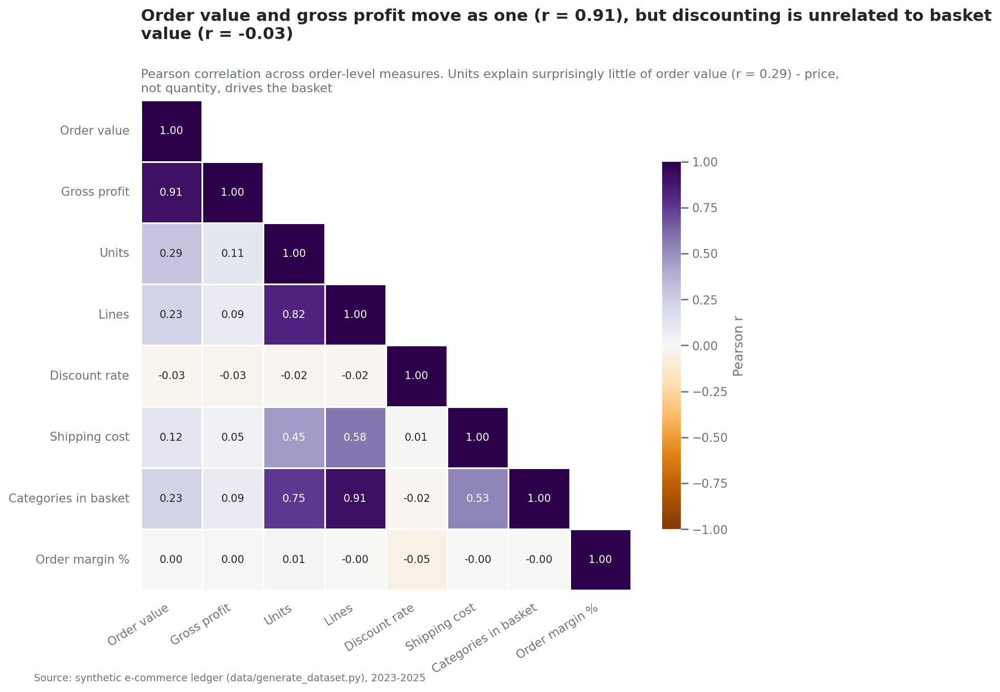

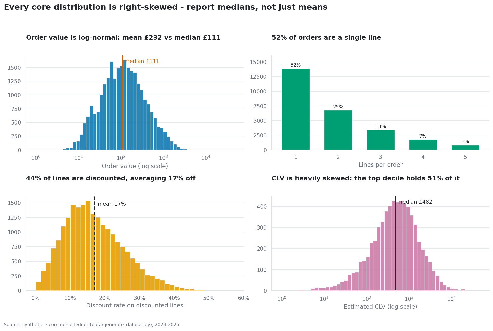

---

## 12. Caveats

* The dataset is **synthetic**, produced by `data/generate_dataset.py` with a fixed seed. The behavioural structure (seasonality, retention decay, Pareto demand, category margins) is real in the sense that it was modelled deliberately - but no conclusion here describes an actual company.
* CLV is a deterministic historic-average model, not a probabilistic one (BG/NBD + Gamma-Gamma would be the upgrade). It is fit for ranking customers, not for forecasting an individual's spend.
* Cohort retention is measured on *orders*, so a customer who browses without buying counts as lapsed.
* 5,422 price outliers and 392 returns are retained rather than dropped; every headline is therefore a net figure and reconciles to the source ledger.
* Chi-square and ANOVA establish association, not causation; the regional segment mix could be driven by any number of unobserved confounders.
