# Customer Churn Prediction

An end-to-end, production-shaped supervised learning project: a deterministic
synthetic dataset, a leakage-free scikit-learn pipeline, a model bake-off with
cross-validated hyper-parameter search, cost-sensitive threshold selection, a
scoring CLI, a FastAPI service and a pytest suite that checks all of it.

Everything in this README is generated by the code in this repository - the
tables below are copied from `reports/model_comparison.csv`,
`reports/test_metrics.json` and `reports/permutation_importance.csv`.

```
make install     # pinned dependencies
make all         # data -> train -> evaluate -> test   (~20 min on 2 cores)
make serve       # FastAPI on http://localhost:8010/docs
```

---

## 1. Problem framing

A subscription telco wants to spend a fixed retention budget on the customers
most likely to leave. The model must therefore answer a **decision** question,
not just a ranking one:

> Given what we know about a customer today, is it worth spending a retention
> offer on them this month?

That framing drives three choices that run through the whole project:

| Decision | Why |
|---|---|
| Optimise **PR-AUC**, not accuracy | 26% positives - a "nobody churns" model already scores 74% accuracy and is worthless. |
| Choose the threshold from a **cost matrix**, not 0.5 | 0.5 is only optimal when a false negative and a false positive cost the same. Here they differ by 10x. |
| Keep probabilities **calibrated** (Brier / calibration curve) | The threshold rule is derived from probabilities, so miscalibration would silently move the operating point. |

### Cost assumptions

| Quantity | Symbol | Value | Meaning |
|---|---|---|---|
| Value of a retained customer | `V` | 500 | 12-month gross margin lost when a customer leaves |
| Retention offer cost | `C` | 50 | Paid for **every** customer we contact, churner or not |
| Offer success rate | `s` | 0.35 | P(customer stays \| true churner who was contacted) |

Acting is worth it when `-(1-s)·V·p - C > -V·p`, i.e. when

```
p*  =  C / (s · V)  =  50 / (0.35 × 500)  =  0.2857
```

This analytical break-even is the yardstick against which the empirical sweep is
judged (see §6). The numbers are illustrative - swap them in `src/config.py` and
re-run `make train` to move the operating point.

---

## 2. Dataset

**The data is synthetic and generated offline** - there is no network call
anywhere in this project. `data/generate_data.py` (seed `20250820`) writes
`data/churn.csv`; both the generator and the CSV are committed so results are
reproducible byte-for-byte (`tests/test_data.py::test_committed_csv_matches_generator`).

* **15,000 rows x 17 columns**, churn rate **26.56%**
* Labels come from a genuine latent logistic process:
  `logit(p) = β₀ + f(x) + interactions + ε`, `y ~ Bernoulli(p)`, with an
  unobserved heterogeneity term `ε ~ N(0, 0.85)` so the Bayes error is well
  above zero (nothing here can reach AUC 0.99). `β₀` is calibrated by bisection
  to hit the 26% prevalence target.
* Embedded interactions - price sensitivity is far stronger for month-to-month
  customers, high spend combined with low usage is the worst signal of all, and
  idle logins only matter when there is no lock-in. These are why the tree
  ensembles edge past the logistic regression.

| Column | Type | Notes |
|---|---|---|
| `customer_id` | id | not a feature |
| `tenure_months` | int 1-72 | mixture of a young cohort and a long-lived cohort |
| `monthly_charges` | float | driven by service mix |
| `total_charges` | float | ≈ `monthly_charges × tenure` with drift/noise; **missing for new accounts** |
| `contract_type` | cat | Month-to-month / One year / Two year |
| `payment_method` | cat | electronic check over-indexes on month-to-month |
| `internet_service` | cat | DSL / Fiber optic / No internet service (1.7% missing) |
| `num_support_tickets` | int | Poisson, rate depends on service and tenure |
| `avg_monthly_usage_gb` | float | lognormal by service type (4.0% missing) |
| `has_streaming`, `is_senior` | bin | |
| `num_dependents` | int 0-6 | 0.8% missing |
| `region` | cat | North / South / East / West |
| `last_login_days` | int | days since last portal login (3.9% missing) |
| `churn_risk_score_v0` | float | **red herring** - see below |
| `account_flagged_for_review` | bin | **red herring** - see below |
| `churn` | target | 26.56% positive |

### Missing values (injected *after* the label is drawn)

| Column | % missing | Mechanism |
|---|---|---|
| `total_charges` | 4.99% | 55% missing when tenure ≤ 2 months (not yet billed) vs 1.2% otherwise |
| `avg_monthly_usage_gb` | 3.99% | telemetry gaps, missing completely at random |
| `last_login_days` | 3.85% | 10% for customers without internet service |
| `internet_service` | 1.69% | CRM rows that lost the product code |
| `num_dependents` | 0.79% | unknown household size |

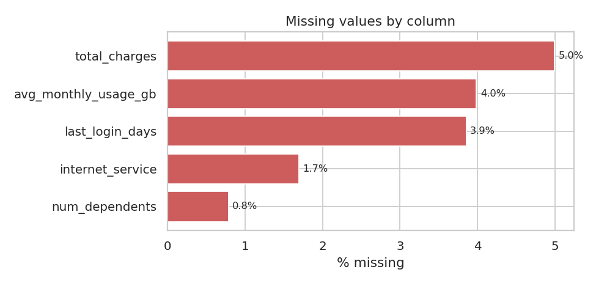

### The two red herrings

Both columns are *named* like post-outcome leakage and are drawn completely
independently of the latent process:

| Column | Univariate AUC | Permutation importance (test) |
|---|---|---|
| `churn_risk_score_v0` ("legacy risk score") | 0.4948 | 0.0000 |
| `account_flagged_for_review` (back-office flag) | 0.5010 | -0.0001 |

They are deliberately **kept as model inputs** so the importance plots
demonstrate that the model ignores them. A scary column name is not evidence of
leakage - and, conversely, an innocent one like `total_charges` is not evidence
of safety (it is legitimate here only because it is a function of `tenure` and
`monthly_charges`, both known before the outcome).

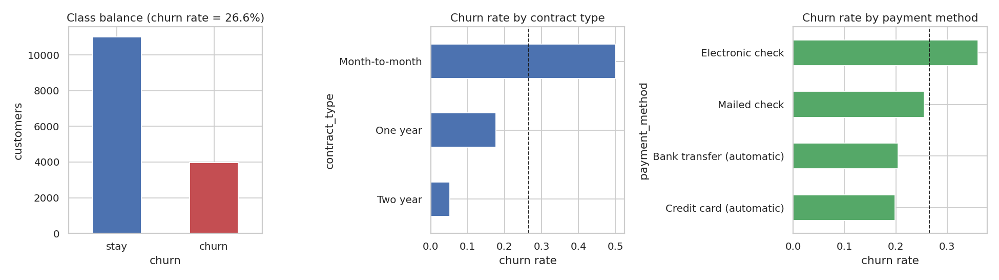
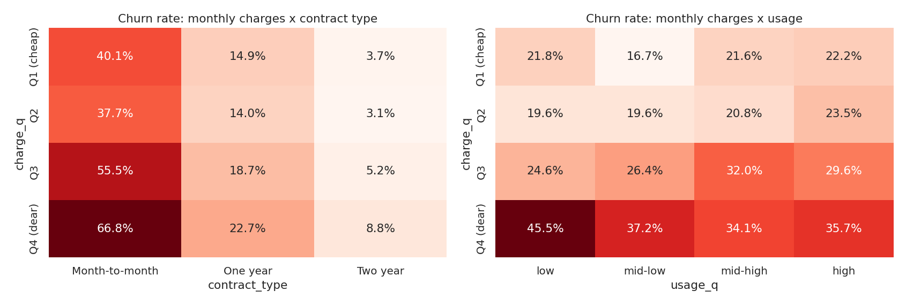

Churn rate by contract: **Month-to-month 50.0%** (n=5,579), **One year 17.6%**
(n=5,670), **Two year 5.2%** (n=3,751).

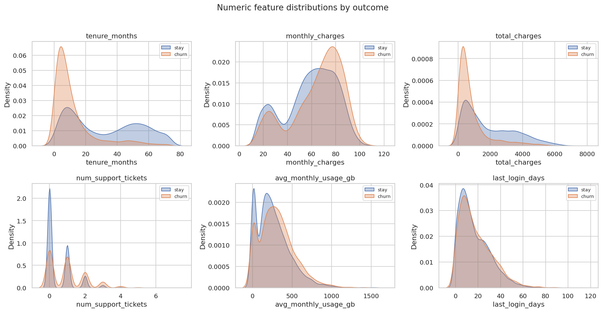
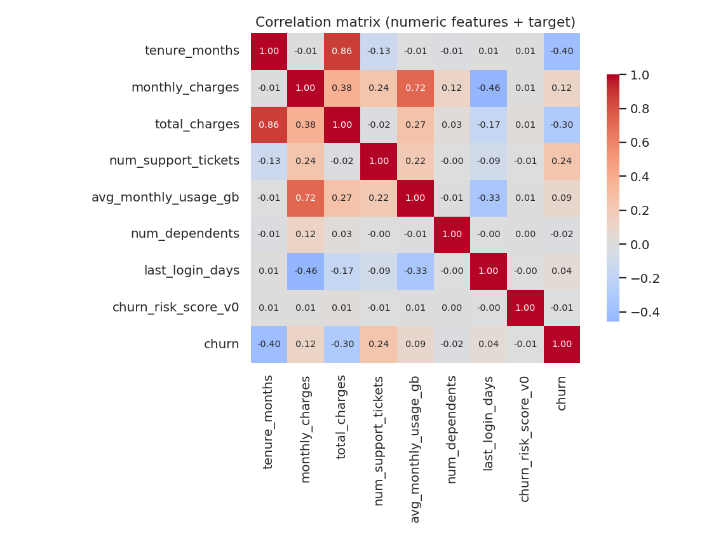

Full EDA narrative with stored outputs: [`notebooks/exploration.ipynb`](notebooks/exploration.ipynb)
(regenerate with `make notebook`).

---

## 3. Methodology

```
data/churn.csv
   └── stratified split 60 / 20 / 20  (train / val / test, seed 20250820)
         ├── train  ── RandomizedSearchCV, StratifiedKFold(5), 5 model families
         ├── val    ── model selection (PR-AUC) + per-family threshold check
         └── test   ── untouched until src/evaluate.py
```

1. **Split first.** The test split is carved out before anything is fitted and
   is loaded exactly once, in `src/evaluate.py`.
2. **Everything inside the pipeline.** Imputation, scaling, one-hot vocabularies
   *and* the per-contract usage statistics are learned in `fit`. Because the
   whole `Pipeline` is the estimator passed to `RandomizedSearchCV`, the
   preprocessing is refit inside every CV fold - validation folds never leak
   into imputer medians or scaler moments.
3. **Search.** 54 candidate configurations across five families, scored on both
   ROC-AUC and PR-AUC; every candidate is appended to `reports/experiments.csv`.
4. **Select** on validation PR-AUC.
5. **Threshold** from *out-of-fold* predictions on train+val (`cross_val_predict`),
   never from test.
6. **Refit** the winner on train+val, persist to `models/churn_model.joblib`
   with `models/metadata.json`.

### Class imbalance

Handled in two complementary places: `class_weight` (`balanced` /
`balanced_subsample` / `None`) is part of the search space for the logistic
regression and random forest, and the decision threshold is tuned explicitly
rather than left at 0.5. The search kept `class_weight="balanced"` only for the
random forest; the logistic regression and the stacking meta-learner both won
with `None`. That is the expected outcome: once the operating point is chosen
from a cost matrix, reweighting the loss mostly duplicates work the threshold
already does - and it distorts the probability calibration that the threshold
rule depends on.

---

## 4. Feature engineering

Four features are added by the custom transformer `FeatureEngineer`
(`src/features.py`), which is the first step of the pipeline and is fitted on
training data only.

| Feature | Definition | Rationale | Leakage risk |
|---|---|---|---|
| `charges_per_tenure_month` | `total_charges / tenure_months` | Realised average spend, which differs from the *current* price for re-priced customers; also survives the `total_charges` missingness pattern. | None - row-local arithmetic |
| `tickets_per_tenure_year` | `num_support_tickets × 12 / tenure_months` | Separates "noisy new joiner" from "chronically unhappy veteran". | None - row-local arithmetic |
| `usage_z_by_contract` | `log1p(usage)` standardised **within contract type** | Encodes "low usage *for someone on this plan*", which is what drives the value-for-money interaction. | **Group mean/std are learned in `fit` on the training fold only** and merely applied at transform time. |
| `tenure_bucket` | `0-6m / 7-12m / 13-24m / 25-48m / 49m+`, one-hot encoded | Lets linear models express the strongly non-linear tenure effect. | None - fixed bin edges from config |

Preprocessing (`ColumnTransformer`):

| Block | Steps |
|---|---|
| 11 numeric columns (8 raw + 3 engineered) | median imputation → `StandardScaler` |
| 8 categorical columns (7 raw + `tenure_bucket`) | most-frequent imputation → `OneHotEncoder(handle_unknown="infrequent_if_exist")` |

→ **36 model features**. Unseen categories at serving time are absorbed rather
than crashing (`tests/test_pipeline.py::test_pipeline_handles_unseen_category_gracefully`).

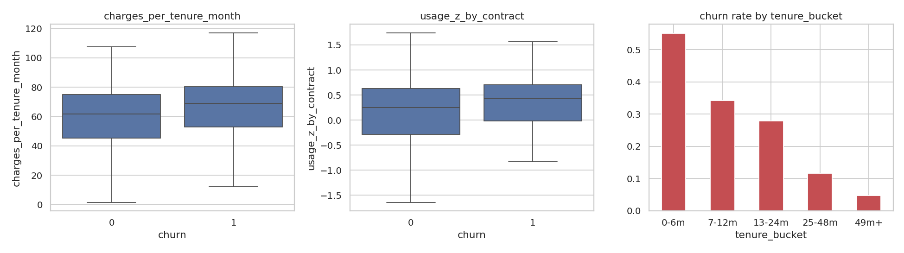

### How "no leakage" is actually tested

* `test_imputer_and_scaler_statistics_come_from_train_only` - the fitted imputer
  statistics equal the train-only medians **and** differ from the full-dataset
  medians (so the assertion is not vacuous).
* `test_group_statistics_are_fit_on_train_only` - the usage z-score group means
  differ from the ones you would get by fitting on the whole dataset.
* `test_transform_is_row_independent` - transforming 12 rows in a batch equals
  transforming them one at a time, so no cross-row information can flow at
  serving time.
* `test_refitting_on_test_changes_the_matrix` - control experiment proving the
  above checks can fail.

---

## 5. Model comparison (real numbers)

54 candidates were evaluated with stratified 5-fold CV on the training split.
Each row is the best candidate of its family; validation columns are scored on
the untouched validation split. Full log: `reports/experiments.csv`.

| Model | CV ROC-AUC | CV PR-AUC | Val ROC-AUC | **Val PR-AUC** | Val Brier | Search (s) |
|---|---|---|---|---|---|---|
| **Stacking ensemble** (LR + RF + HGB → logistic meta) | 0.8678 ± 0.0041 | 0.7133 | 0.8593 | **0.6959** | 0.1298 | 204 |
| HistGradientBoosting | 0.8660 ± 0.0037 | 0.7089 | 0.8584 | 0.6927 | 0.1291 | 42 |
| Random forest | 0.8629 ± 0.0036 | 0.6995 | 0.8558 | 0.6920 | 0.1526 | 175 |
| Gradient boosting | 0.8682 ± 0.0047 | 0.7126 | 0.8590 | 0.6910 | 0.1293 | 103 |
| Logistic regression (elastic net) | 0.8671 ± 0.0056 | 0.7118 | 0.8580 | 0.6863 | 0.1296 | 38 |

Winning hyper-parameters:

```json
{"final_estimator__C": 3.214343, "final_estimator__class_weight": null}
```
base learners: `LogisticRegression(C=0.459, l1_ratio=0.5)`,
`RandomForest(n_estimators=250, max_depth=7, min_samples_leaf=22, max_features=0.4, class_weight="balanced")`,
`HistGradientBoosting(lr=0.0178, max_iter=450, max_leaf_nodes=14, min_samples_leaf=59, l2=0.0012)`.

**Honest reading of this table:** the five families are within ~0.01 PR-AUC of
each other, which is what you expect when the data-generating process is a
logistic model with a handful of interactions. The stacking ensemble wins, but
it costs 5x the training time and ~20x the inference cost of the
HistGradientBoosting model for +0.003 PR-AUC. In production the single
HistGradientBoosting model would be the defensible choice; the stack is kept
here because the selection rule was fixed *before* looking at the results.

---

## 6. Final test-set results

Held-out test split, 3,000 customers, 26.57% churn, threshold **0.29**
(`reports/test_metrics.json`).

| Metric | Value |
|---|---|
| Accuracy | **0.7893** |
| Precision | **0.5824** |
| Recall | **0.7315** |
| F1 | **0.6485** |
| ROC-AUC | **0.8644** |
| PR-AUC | **0.7185** (prevalence baseline 0.2657) |
| Brier score | **0.1248** |
| Log loss | 0.3948 |

Confusion matrix (rows = actual):

|  | pred stay | pred churn |
|---|---|---|
| **stay** | 1,785 (TN) | 418 (FP) |
| **churn** | 214 (FN) | 583 (TP) |

```
              precision    recall  f1-score   support
        stay     0.8929    0.8103    0.8496      2203
       churn     0.5824    0.7315    0.6485       797
    accuracy                         0.7893      3000
```

For reference, the same model at the default 0.5 threshold: accuracy 0.8277,
precision 0.7115, recall **0.5910**, F1 0.6456 - better accuracy, but it misses
326 churners instead of 214, which is exactly the trade the cost matrix says we
should not make.

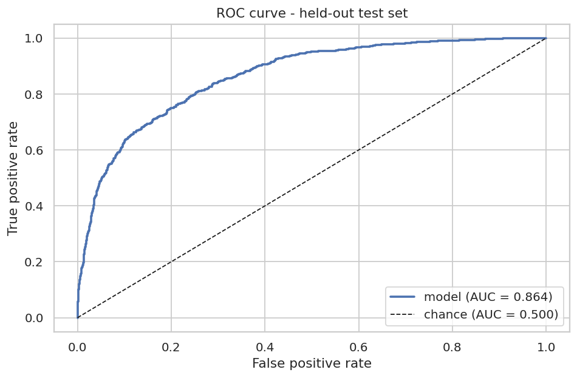
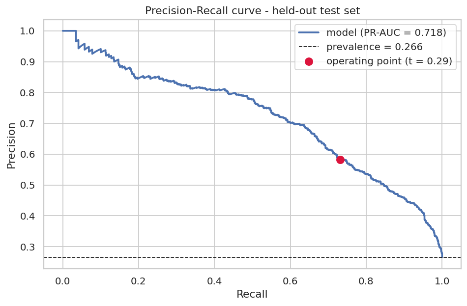
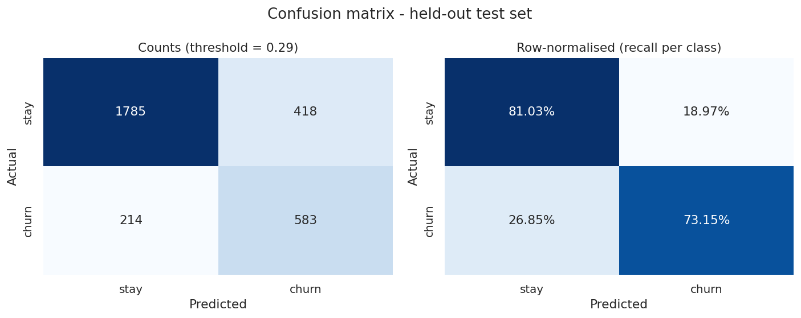
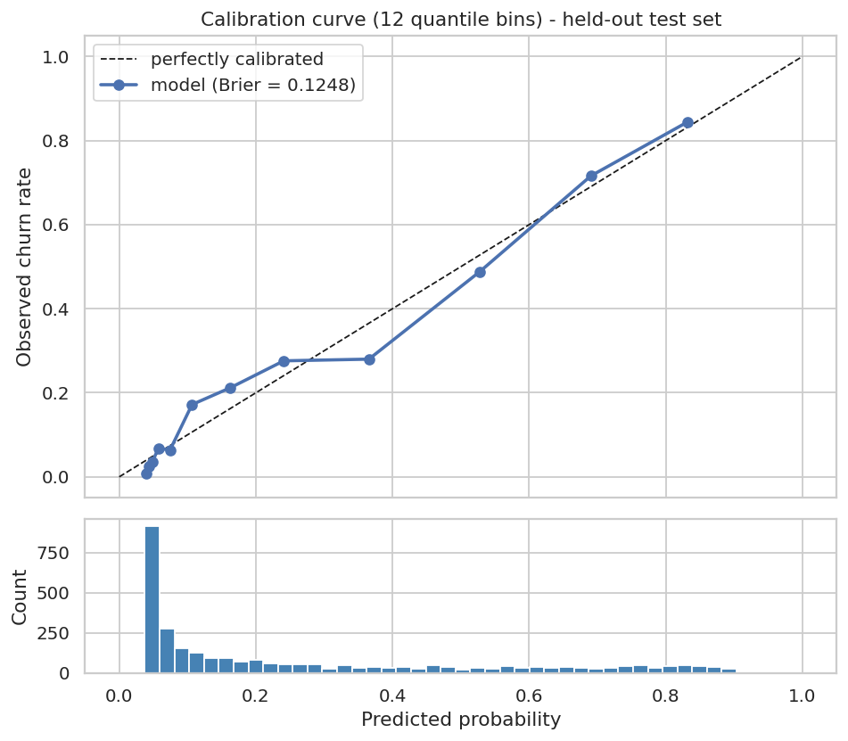

### Chosen threshold and business rationale

| Policy | Expected value per customer | Total over 3,000 customers |
|---|---|---|
| Do nothing | -132.83 | -398,500 |
| Contact everyone | -136.34 | -409,025 |
| **Model @ 0.29** | **-115.51** | **-346,525** |
| Best possible threshold on test (0.33) | -115.24 | -345,725 |

The model policy is worth **+17.32 per customer versus doing nothing**
(+51,975 across the test set) and **+20.83 per customer versus blanket
contact** - blanket contact is actually *worse* than doing nothing here, because
74% of the offers land on customers who were never going to leave.

The threshold is chosen by maximising expected value on out-of-fold train+val
predictions, with one refinement: **the EV curve is flat near its peak**. On the
out-of-fold sweep (`reports/threshold_sweep.csv`) the raw argmax is 0.21 at
-114.58 per customer, but every threshold from 0.19 to 0.32 is within 0.5 per
customer of it, and every threshold from **0.13 to 0.42** is within one standard
error (±1.57). Picking the argmax of such a flat, noisy curve is unstable - an
earlier run of exactly this code chose 0.21, another 0.30, on data that differed
only by the random search seed path. So `choose_threshold` keeps every threshold
within **one standard error** of the maximum and, among those statistically
indistinguishable options, takes the one closest to the analytical break-even
`p* = C / (s·V) = 0.2857`. That yields **0.29** - stable across re-runs,
consistent with the cost model, and within 0.27 currency units per customer of
the (unknowable in advance) test-set optimum of 0.33.

Operationally, 0.29 means contacting **33.4% of the base** to reach **73.2% of
the churners** at 58.2% precision.

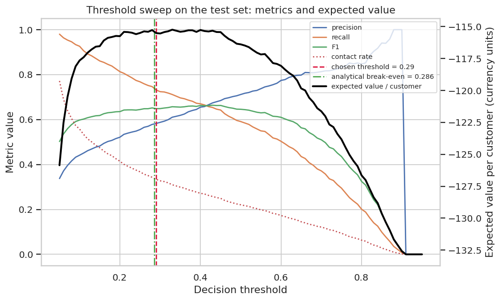

### What the model actually uses

Permutation importance on the raw input columns (drop in test ROC-AUC when a
column is shuffled, 8 repeats):

| Rank | Feature | Δ ROC-AUC |
|---|---|---|
| 1 | `tenure_months` | 0.1798 ± 0.0060 |
| 2 | `contract_type` | 0.1098 ± 0.0069 |
| 3 | `num_support_tickets` | 0.0132 ± 0.0010 |
| 4 | `monthly_charges` | 0.0118 ± 0.0020 |
| 5 | `last_login_days` | 0.0062 ± 0.0013 |
| 6 | `total_charges` | 0.0045 ± 0.0009 |
| 7 | `internet_service` | 0.0025 ± 0.0006 |
| 8 | `payment_method` | 0.0019 ± 0.0003 |
| … | … | … |
| 13 | `churn_risk_score_v0` *(red herring)* | 0.0000 ± 0.0001 |
| 15 | `account_flagged_for_review` *(red herring)* | -0.0001 ± 0.0000 |

Both red herrings land at the bottom, as designed.

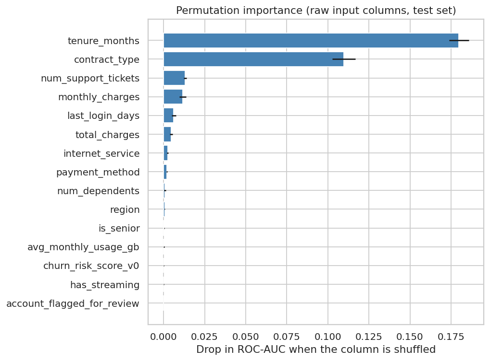

**A note on SHAP.** `shap==0.51.0` installs and works cleanly here, and
`src/explain.py` uses `TreeExplainer` / `LinearExplainer` automatically whenever
the selected model is a single tree ensemble or a logistic regression (it did
exactly that during development, when HistGradientBoosting won a shorter search).
Exact SHAP for a *stack* of heterogeneous learners is prohibitively expensive, so
for the selected stacking model the project falls back to a **group-aware
occlusion attribution**: one source feature at a time is replaced by its
background distribution (numeric → median; one-hot group → expectation over the
background level frequencies, so the whole group moves together and the row
stays on-manifold), and the change in `P(churn)` is the contribution. The figure
below is drawn with SHAP's beeswarm renderer and its title always states which
method produced the values.

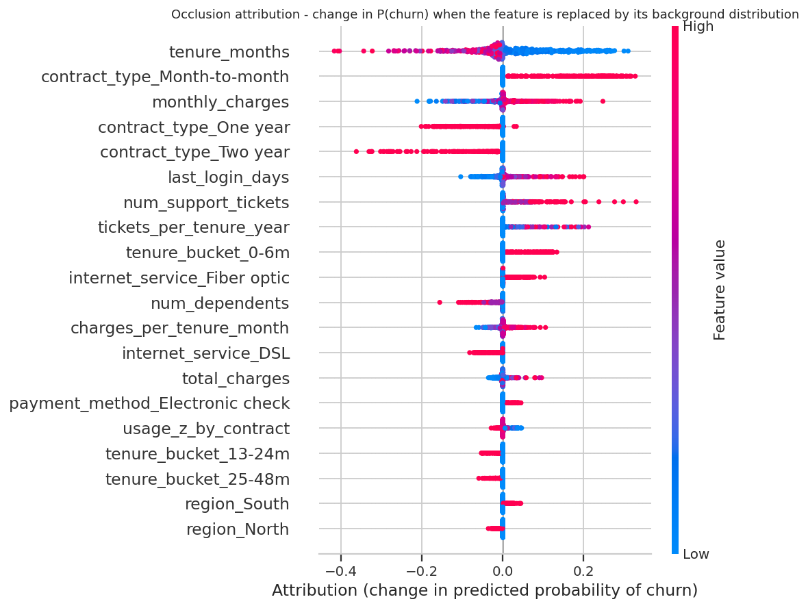

### Learning curve

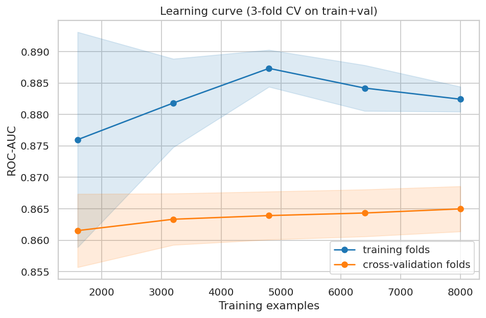

3-fold CV on the 12,000-row train+val set, so each point uses up to 8,000
training rows. The cross-validation curve is essentially flat from 3,200 rows
onwards (0.8634 → 0.8650 ROC-AUC) and the train/CV gap is only ~0.017 AUC: the
model is bias-limited, not variance-limited, so more rows of the *same* features
would buy almost nothing. The remaining error is the irreducible noise built into
the generator plus whatever the feature set cannot express - better features (or
an uplift reframing) would help, more data would not.

---

## 7. How to run each step

| Step | Command | Output |
|---|---|---|
| Install | `make install` | pinned deps from `requirements.txt` |
| Generate data | `make data` | `data/churn.csv`, `data/sample_input.json`, `data/sample_batch.csv` |
| Train | `make train` | `models/churn_model.joblib`, `models/metadata.json`, `reports/experiments.csv`, `reports/model_comparison.csv` |
| Evaluate | `make evaluate` | `reports/test_metrics.json`, `reports/classification_report.txt`, 8 figures |
| Test | `make test` | 65 tests |
| Score a record | `make predict` | JSON to stdout |
| Serve | `make serve` (`PORT=8010`) | FastAPI on `http://localhost:8010` |
| Notebook | `make notebook` | executes `notebooks/exploration.ipynb` in place, outputs stored |
| Everything | `make all` | data → train → evaluate → test |

`make train` accepts `TRAINING_DATE=YYYY-MM-DD` (recorded in `metadata.json`);
`python -m src.train --fast` runs a 3-candidate smoke search.

### Scoring CLI

```bash
# single record
python -m src.predict --input data/sample_input.json

# batch, written to CSV
python -m src.predict --csv data/sample_batch.csv --output reports/scored.csv

# override the operating threshold, skip attributions for speed
python -m src.predict --csv data/churn.csv --limit 500 --threshold 0.4 --no-explain
```

```json
{
  "customer_id": "CUST-000001",
  "churn_probability": 0.679021,
  "churn_label": 1,
  "prediction": "churn",
  "threshold": 0.29,
  "risk_band": "high",
  "top_features": [
    {"feature": "contract_type_Month-to-month", "value": 1.0,
     "contribution": 0.3002, "direction": "increases churn risk"},
    {"feature": "tenure_months", "value": -0.884,
     "contribution": 0.1027, "direction": "increases churn risk"},
    {"feature": "num_support_tickets", "value": 0.4659,
     "contribution": 0.0602, "direction": "increases churn risk"}
  ],
  "explanation_method": "occlusion"
}
```

(`value` is the *transformed* feature value - numeric columns are standardised,
so -0.884 means "0.88 standard deviations below the training mean tenure".)

---

## 8. API

```bash
make serve                       # or: uvicorn api.main:app --host 0.0.0.0 --port 8010
```

Interactive docs at `http://localhost:8010/docs`. The joblib pipeline is loaded
once in the FastAPI lifespan hook, not per request.

| Method | Path | Purpose |
|---|---|---|
| GET | `/health` | liveness + whether the model is loaded |
| GET | `/model-info` | model name, version pins, threshold, cost matrix, feature list, CV/val/test metrics |
| POST | `/predict` | one pydantic-validated record |
| POST | `/predict/batch` | up to 1,000 records, optional threshold override |

### `GET /health`

```bash
curl -s http://localhost:8010/health
```
```json
{"status":"ok","model_loaded":true,"model_name":"stacking_ensemble",
 "loaded_at":"2026-08-20T17:11:11+00:00","api_version":"1.0.0"}
```

### `GET /model-info`

```bash
curl -s http://localhost:8010/model-info
```
```json
{"model_name":"stacking_ensemble","model_class":"StackingClassifier",
 "training_date":"2026-08-20","sklearn_version":"1.8.0","python_version":"3.11.15",
 "chosen_threshold":0.29,
 "cost_matrix":{"value_of_retained_customer":500.0,"retention_offer_cost":50.0,
                "retention_success_rate":0.35},
 "n_model_features":36, "...":"..."}
```

### `POST /predict`

```bash
curl -s -X POST http://localhost:8010/predict \
  -H 'Content-Type: application/json' \
  -d '{
    "customer_id": "CUST-000042",
    "tenure_months": 2, "monthly_charges": 98.4, "total_charges": 191.2,
    "contract_type": "Month-to-month", "payment_method": "Electronic check",
    "internet_service": "Fiber optic", "num_support_tickets": 3,
    "avg_monthly_usage_gb": 55.0, "has_streaming": 1, "is_senior": 1,
    "num_dependents": 0, "region": "South", "last_login_days": 38,
    "churn_risk_score_v0": 72.4, "account_flagged_for_review": 1
  }'
```
```json
{"customer_id":"CUST-000042","churn_probability":0.91034,"churn_label":1,
 "prediction":"churn","threshold":0.29,"risk_band":"high",
 "top_features":[
   {"feature":"contract_type_Month-to-month","value":1.0,"contribution":0.062,
    "direction":"increases churn risk"},
   {"feature":"tenure_months","value":-1.1089,"contribution":0.0158,
    "direction":"increases churn risk"},
   {"feature":"tickets_per_tenure_year","value":5.0667,"contribution":0.0125,
    "direction":"increases churn risk"}],
 "explanation_method":"occlusion"}
```

A long-tenure, two-year-contract customer on the same endpoint returns
`{"churn_probability":0.037407,"prediction":"stay","risk_band":"very low"}`.

Nullable fields (`total_charges`, `avg_monthly_usage_gb`, `last_login_days`,
`internet_service`, `num_dependents`) may be sent as `null`; the pipeline's
imputers handle them.

### `POST /predict/batch`

```bash
curl -s -X POST http://localhost:8010/predict/batch \
  -H 'Content-Type: application/json' \
  -d '{"records": [ { ...record... }, { ...record... } ], "threshold": 0.4}'
```
```json
{"n":2,"threshold":0.4,"predicted_churn_rate":0.5,"predictions":[ ... ]}
```

### Validation errors

The record schema is strict (`extra="forbid"`, `Literal` category types, ranged
numerics), so bad payloads fail fast with **422**:

```bash
curl -s -o /dev/null -w '%{http_code}\n' -X POST http://localhost:8010/predict \
  -H 'Content-Type: application/json' -d '{"contract_type": "Lifetime", ...}'
# 422
```

Covered cases: unknown category, out-of-range tenure, negative charges,
non-binary flags, wrong types, unexpected extra fields, missing required fields,
empty batch, threshold outside (0, 1).

---

## 9. Project structure

```
10-machine-learning/
├── Makefile                    # data / train / evaluate / test / serve / notebook / all
├── requirements.txt            # pinned versions
├── pytest.ini
├── data/
│   ├── generate_data.py        # deterministic generator (seed 20250820)
│   ├── churn.csv               # 15,000 rows - committed
│   ├── sample_input.json       # single-record payload for the CLI/API
│   └── sample_batch.csv        # 25-row batch payload
├── src/
│   ├── config.py               # paths, seed, schema, search spaces, cost matrix
│   ├── data.py                 # load, validate_schema, stratified 60/20/20 split
│   ├── features.py             # FeatureEngineer + ColumnTransformer + Pipeline
│   ├── train.py                # search, compare, select, threshold, persist
│   ├── evaluate.py             # test metrics + 8 figures
│   ├── explain.py              # SHAP / group-aware occlusion attributions
│   └── predict.py              # scoring CLI
├── api/
│   └── main.py                 # FastAPI service
├── tests/                      # 65 pytest tests
│   ├── conftest.py
│   ├── test_data.py            # determinism, schema, splits, red herrings
│   ├── test_pipeline.py        # shapes, NaNs, leakage controls
│   ├── test_model.py           # persisted model, metadata, threshold economics
│   └── test_api.py             # endpoints + 422 validation matrix
├── models/
│   ├── churn_model.joblib      # fitted sklearn Pipeline
│   ├── background.joblib       # transformed background sample for attributions
│   └── metadata.json           # versions, features, params, threshold, metrics
├── notebooks/
│   ├── exploration.ipynb       # executed EDA narrative (outputs stored)
│   └── _build_notebook.py      # regenerates the notebook source
└── reports/
    ├── experiments.csv         # every search candidate, params + CV metrics
    ├── model_comparison.csv    # best candidate per family
    ├── test_metrics.json       # held-out metrics + expected value
    ├── threshold_sweep.csv     # out-of-fold sweep used to pick the threshold
    ├── threshold_sweep_test.csv, oof_predictions.csv
    ├── permutation_importance.csv, contribution_importance.csv
    ├── classification_report.txt
    └── figures/                # 14 PNGs (8 model + 6 EDA)
```

---

## 10. Limitations and next steps

**Limitations**

1. **Synthetic data.** The generator is a logistic model, so a logistic
   regression is close to the Bayes-optimal family. Real churn data would have
   heavier tails, drift and messier categories; do not read the 0.86 ROC-AUC as
   a claim about real telco data.
2. **No temporal dimension.** The split is random, not time-based. Real churn
   modelling needs an out-of-time validation window, since both the feature
   distribution and the churn base rate drift.
3. **The cost matrix is an assumption, not a measurement.** `V`, `C` and
   especially the 35% offer success rate should come from a holdout experiment.
   The EV numbers scale linearly with them.
4. **No uplift modelling.** The model ranks *who will churn*, not *who will
   respond to an offer*. Some of the flagged customers would have stayed anyway,
   and some are unsavable - a two-model uplift (or a treatment-assignment
   experiment) is the correct next step.
5. **Calibration is good, not perfect.** The calibration curve over-predicts
   slightly in the 0.3-0.5 band; `CalibratedClassifierCV` (isotonic) on a
   dedicated calibration split would tighten the Brier score and make the
   threshold rule more trustworthy.
6. **Attribution for the stack is approximate.** The occlusion method is
   marginal (one feature at a time) and therefore under-credits correlated
   groups; contributions also compress near p ≈ 0 or 1.
7. **The ensemble is not worth its cost.** +0.003 PR-AUC for 5x training and
   ~20x inference time (see §5).
8. **No monitoring, auth or rate limiting** on the API; it is a reference
   implementation, not a hardened service.

**Next steps**

* Out-of-time validation + a drift monitor on the input distribution and on the
  realised churn rate per score decile.
* Isotonic calibration on a dedicated split, then re-derive the threshold.
* Uplift / treatment-effect modelling to spend the retention budget on
  *persuadable* customers rather than *likely* churners.
* Promote HistGradientBoosting to the served model and keep the stack as an
  offline benchmark.
* Model registry + CI (`make all` in a pipeline), request/response logging with
  the model version so predictions can be replayed.
* Segment-level fairness slices (e.g. `is_senior`, `region`) on precision and
  recall before any of this touches real customers.
